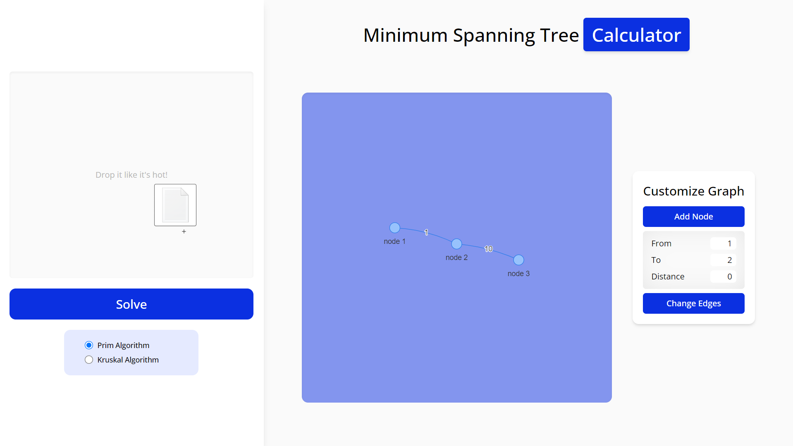
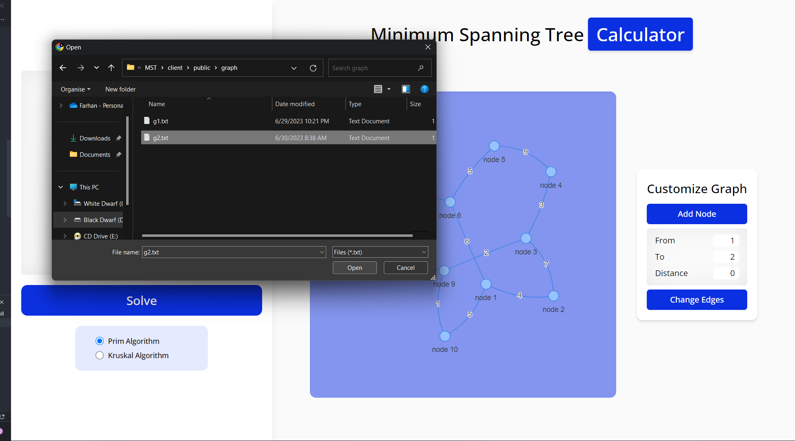

# Minimum Spanning Tree Calculator

Minimum Spanning Tree Calculator is a web application built using React, TypeScript, and Tailwind CSS. The app provides functionality to calculate the minimum spanning tree (MST) of a graph using the Prim and Kruskal algorithms.

## Table of Contents

- [Features](#features)
- [Installation](#installation)
- [Usage](#usage)
- [Contributing](#contributing)
- [Contact](#contact)

## Features

- `File Upload`: Users can upload a text file containing an n×n weighted adjacency matrix to generate the graph for MST calculation.
- `Manual Graph Editing`: Users have the option to manually add nodes and edges or modify an existing graph directly within the web app.
- `Prim's Algorithm`: The application utilizes Prim's algorithm to calculate the minimum spanning tree of the given graph.
- `Kruskal's Algorithm`: Users can choose to apply Kruskal's algorithm instead of Prim's to find the MST.
- `Visual Representation`: The web app provides a visual representation of the graph and the resulting minimum spanning tree, allowing users to better understand the structure and connections.

## Installation

To install this web app, follow the steps below:

1. Clone this repository or download it as a ZIP file.
2. Navigate to the root folder execute `npm i` and then `npm run dev`.
3. Open https://localhost:5173/ in your web browser.

Alternatively, you can directly use this web app by visiting https://mst-calculator.vercel.app/.

## Usage

### Drag & Drop Input

### Browse File

### Configure Nodes

## Contributing

Mohammad Farhan Fahrezy

## Contact

- [Personal Website](https://farhanfahreezy.site/)
- [Linkedin](https://www.linkedin.com/in/farhanfahreezy/)
